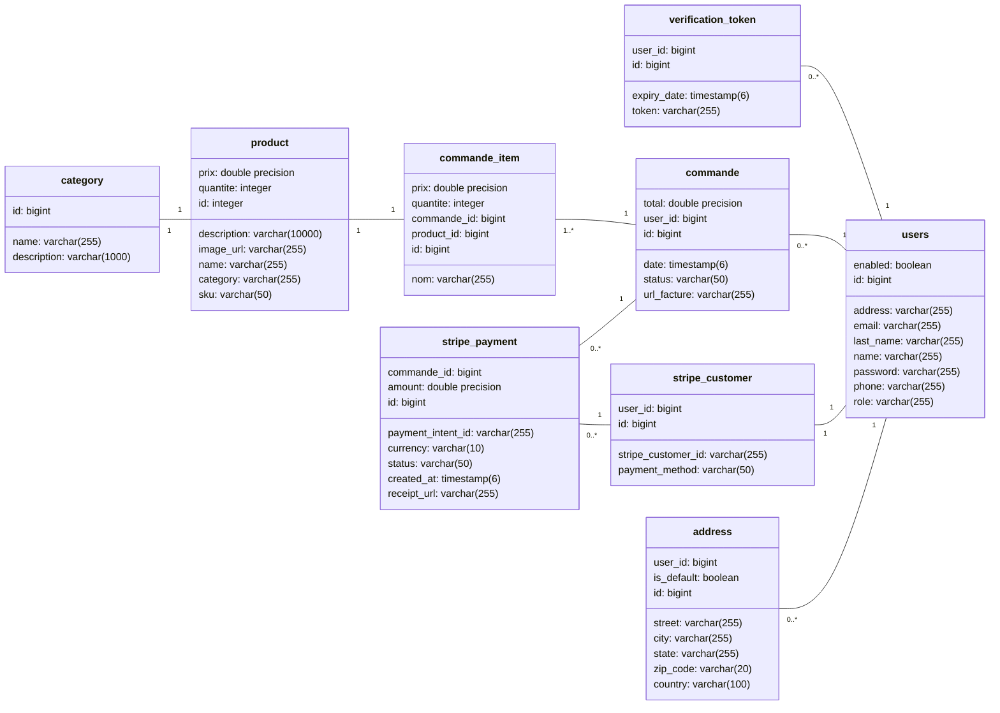

```mermaid
classDiagram
    direction RL

    class users {
        address: varchar(255)
        email: varchar(255)
        enabled: boolean
        last_name: varchar(255)
        name: varchar(255)
        password: varchar(255)
        phone: varchar(255)
        role: varchar(255)
        id: bigint
    }

    class verification_token {
        expiry_date: timestamp(6)
        token: varchar(255)
        user_id: bigint
        id: bigint
    }

    class commande {
        date: timestamp(6)
        total: double precision
        status: varchar(50)
        user_id: bigint
        url_facture: varchar(255)
        id: bigint
    }

    class commande_item {
        nom: varchar(255)
        prix: double precision
        quantite: integer
        commande_id: bigint
        product_id: bigint
        id: bigint
    }

    class product {
        description: varchar(10000)
        image_url: varchar(255)
        prix: double precision
        quantite: integer
        name: varchar(255)
        category: varchar(255)
        sku: varchar(50)
        id: integer
    }

    class stripe_customer {
        user_id: bigint
        stripe_customer_id: varchar(255)
        payment_method: varchar(50)
        id: bigint
    }

    class stripe_payment {
        commande_id: bigint
        payment_intent_id: varchar(255)
        amount: double precision
        currency: varchar(10)
        status: varchar(50)
        created_at: timestamp(6)
        receipt_url: varchar(255)
        id: bigint
    }

    class category {
        name: varchar(255)
        description: varchar(1000)
        id: bigint
    }

    class address {
        user_id: bigint
        street: varchar(255)
        city: varchar(255)
        state: varchar(255)
        zip_code: varchar(20)
        country: varchar(100)
        is_default: boolean
        id: bigint
    }

    users "1" -- "0..*" verification_token
    users "1" -- "0..*" commande
    users "1" -- "1" stripe_customer
    users "1" -- "0..*" address

    commande "1" -- "1..*" commande_item
    commande "1" -- "0..*" stripe_payment

    commande_item "1" -- "1" product

    stripe_customer "1" -- "0..*" stripe_payment

    product "1" -- "1" category
```