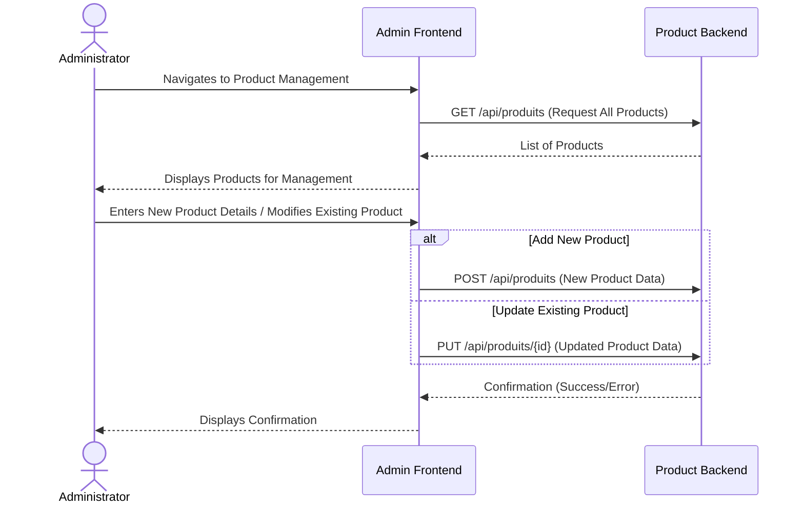

```mermaid
sequenceDiagram
    actor Administrator
    participant Frontend as Admin Frontend
    participant ProductBackend as Product Backend

    Administrator->>Frontend: Navigates to Product Management
    Frontend->>ProductBackend: GET /api/produits (Request All Products)
    ProductBackend-->>Frontend: List of Products
    Frontend-->>Administrator: Displays Products for Management

    Administrator->>Frontend: Enters New Product Details / Modifies Existing Product
    alt Add New Product
        Frontend->>ProductBackend: POST /api/produits (New Product Data)
    else Update Existing Product
        Frontend->>ProductBackend: PUT /api/produits/{id} (Updated Product Data)
    end
    ProductBackend-->>Frontend: Confirmation (Success/Error)
    Frontend-->>Administrator: Displays Confirmation
```