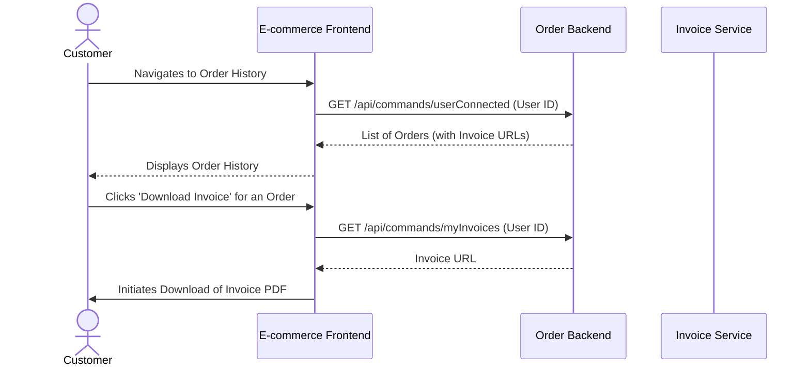

```mermaid
sequenceDiagram
    actor Customer
    participant Frontend as E-commerce Frontend
    participant OrderBackend as Order Backend
    participant InvoiceService as Invoice Service

    Customer->>Frontend: Navigates to Order History
    Frontend->>OrderBackend: GET /api/commands/userConnected (User ID)
    OrderBackend-->>Frontend: List of Orders (with Invoice URLs)
    Frontend-->>Customer: Displays Order History

    Customer->>Frontend: Clicks 'Download Invoice' for an Order
    Frontend->>OrderBackend: GET /api/commands/myInvoices (User ID)
    OrderBackend-->>Frontend: Invoice URL
    Frontend->>Customer: Initiates Download of Invoice PDF
```