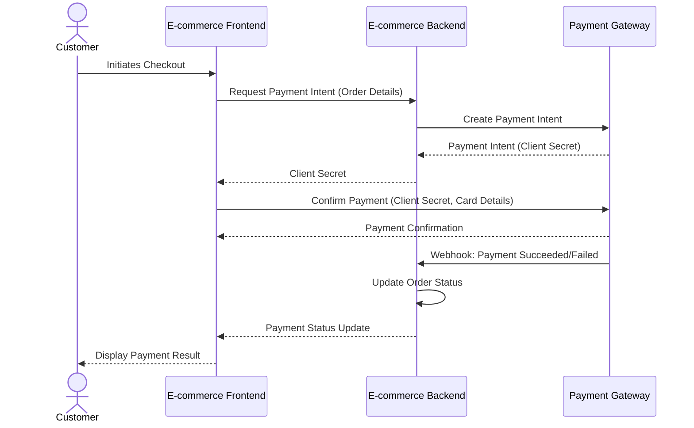

```mermaid
sequenceDiagram
    actor Customer
    participant Frontend as E-commerce Frontend
    participant Backend as E-commerce Backend
    participant PaymentGateway as Payment Gateway

    Customer->>Frontend: Initiates Checkout
    Frontend->>Backend: Request Payment Intent (Order Details)
    Backend->>PaymentGateway: Create Payment Intent
    PaymentGateway-->>Backend: Payment Intent (Client Secret)
    Backend-->>Frontend: Client Secret
    Frontend->>PaymentGateway: Confirm Payment (Client Secret, Card Details)
    PaymentGateway-->>Frontend: Payment Confirmation
    PaymentGateway->>Backend: Webhook: Payment Succeeded/Failed
    Backend->>Backend: Update Order Status
    Backend-->>Frontend: Payment Status Update
    Frontend-->>Customer: Display Payment Result
```