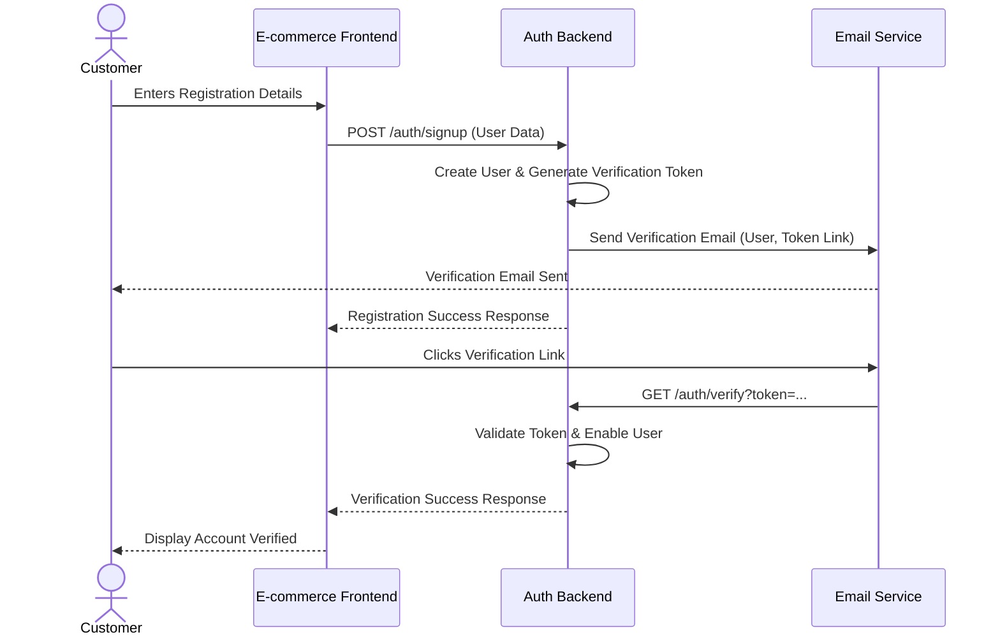

```mermaid
sequenceDiagram
    actor Customer
    participant Frontend as E-commerce Frontend
    participant AuthBackend as Auth Backend
    participant EmailService as Email Service

    Customer->>Frontend: Enters Registration Details
    Frontend->>AuthBackend: POST /auth/signup (User Data)
    AuthBackend->>AuthBackend: Create User & Generate Verification Token
    AuthBackend->>EmailService: Send Verification Email (User, Token Link)
    EmailService-->>Customer: Verification Email Sent
    AuthBackend-->>Frontend: Registration Success Response

    Customer->>EmailService: Clicks Verification Link
    EmailService->>AuthBackend: GET /auth/verify?token=...
    AuthBackend->>AuthBackend: Validate Token & Enable User
    AuthBackend-->>Frontend: Verification Success Response
    Frontend-->>Customer: Display Account Verified
```